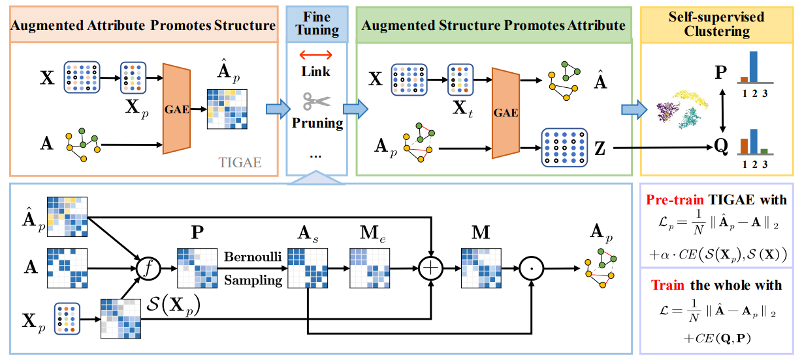
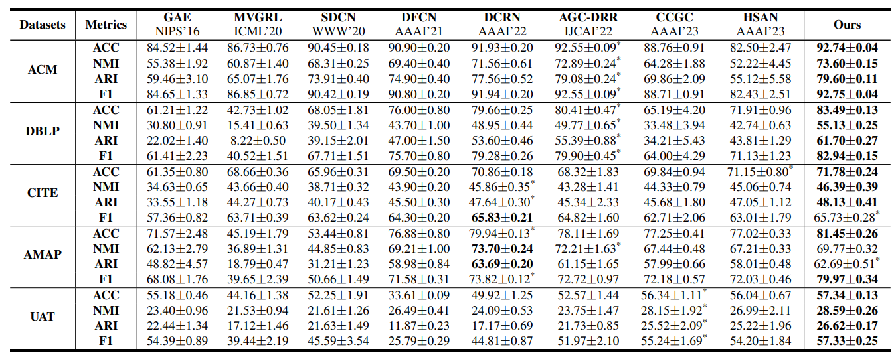
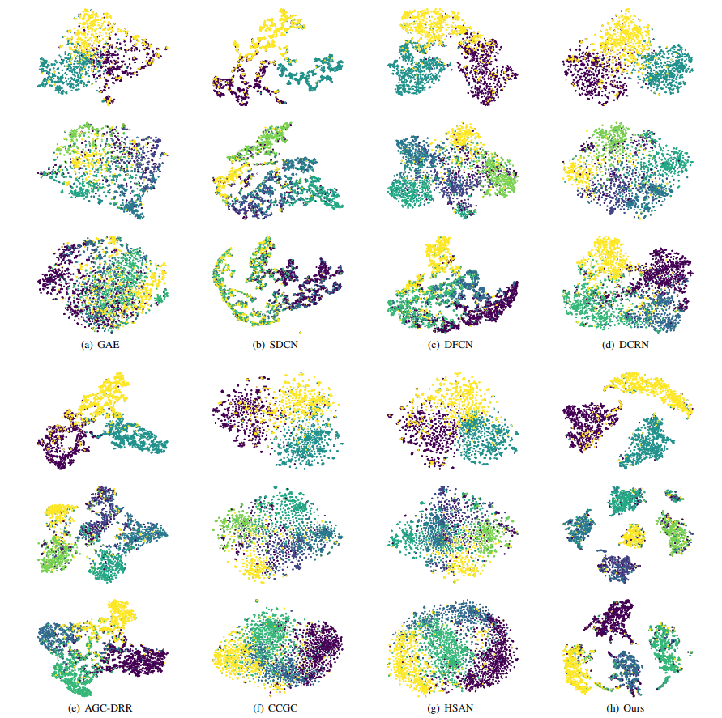

# Deep Graph Clustering via Mutual Augmentation of Structure and Attribute

An official source code for paper 'Deep Graph Clustering via Mutual Augmentation of Structure and Attribute'. This repository is based on the unified framework for deep attribute graph clustering ([https://github.com/Marigoldwu/A-Unified-Framework-for-Deep-Attribute-Graph-Clustering](https://github.com/Marigoldwu/A-Unified-Framework-for-Deep-Attribute-Graph-Clustering)) .

## Overview

We propose a clustering framework called Deep Graph Clustering via Mutual Augmentation of Structure and Attribute (GCMA). In our approach, we design a Transform Input Graph Auto-Encoder (TIGAE) via attribute augmentation, which obtains high-quality embeddings for generating the augmented graph. Then, we re-capture neighborhood information on the augmented graph to obtain clustering-friendly embeddings and conduct self-supervised clustering. It is worth mentioning that the mutual augmentation stages share parameters, resulting in efficiency gains in both time and space. Additionally, we introduce a structure fine-tuning strategy to prevent the augmented graph from deviating from the original graph. Extensive experiments on benchmark datasets demonstrate the clear superiority and effectiveness of our method.



Fig. 1 Illustration of our proposed GCMA framework.

## Requirements

The proposed GCMA is implemented with python 3.7 on a Tesla T4 GPU.

Python package information is summarized in **requirements.txt**:

```
matplotlib==3.5.3
munkres==1.1.4
numpy==1.17.2
scikit_learn==1.0.2
scipy==1.7.3
torch==1.10.2
```

## Quick Start

```bash
python main.py -M GCMA -D acm -LS 1 -S 325
```

> - You can use -TS to obtain the t-SNE visualization of clustering results, and the picture will be saved to the 'img/clustering/GCMA'. 
>-  You can use -H to obtain the heatmap of embeddings, and the picture will be saved to the 'img/heatmap/GCMA'. 

## Clustering Results



Table 1 Clustering results of different methods on five datasets. 



Fig. 2 2D t-SNE visualization of eight methods. From the first row to the third row, the datasets are ACM, CITE, DBLP